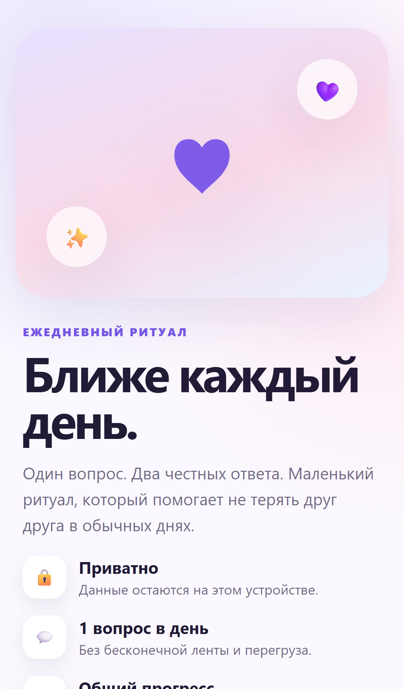
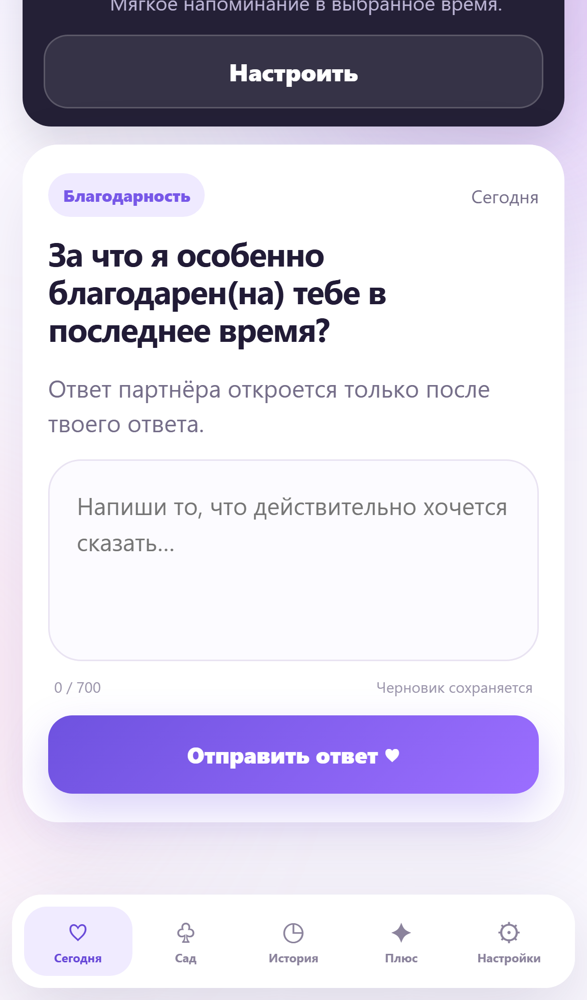
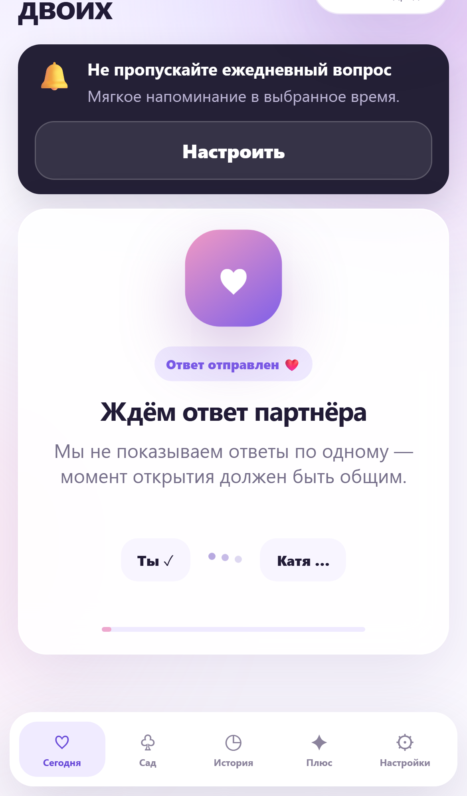
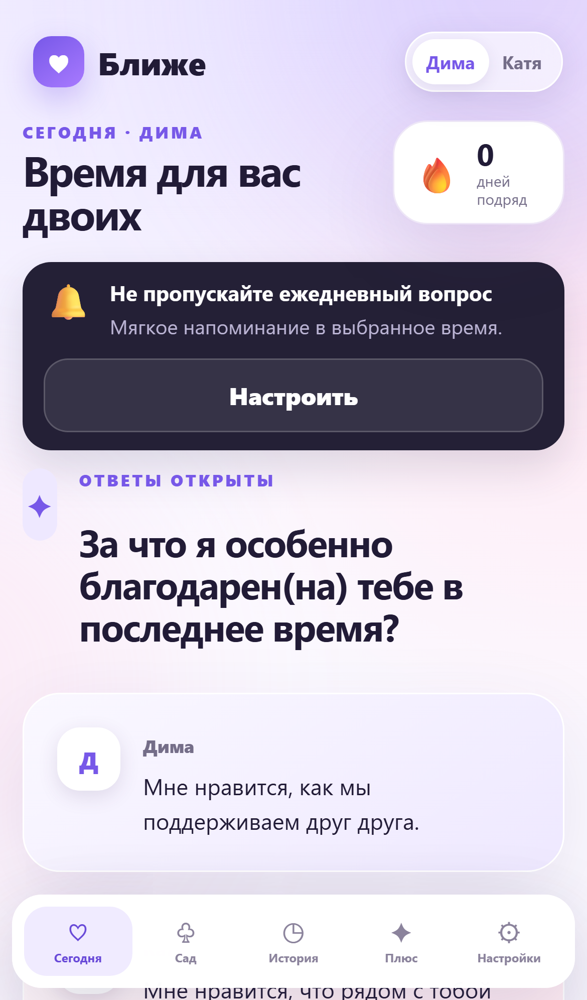
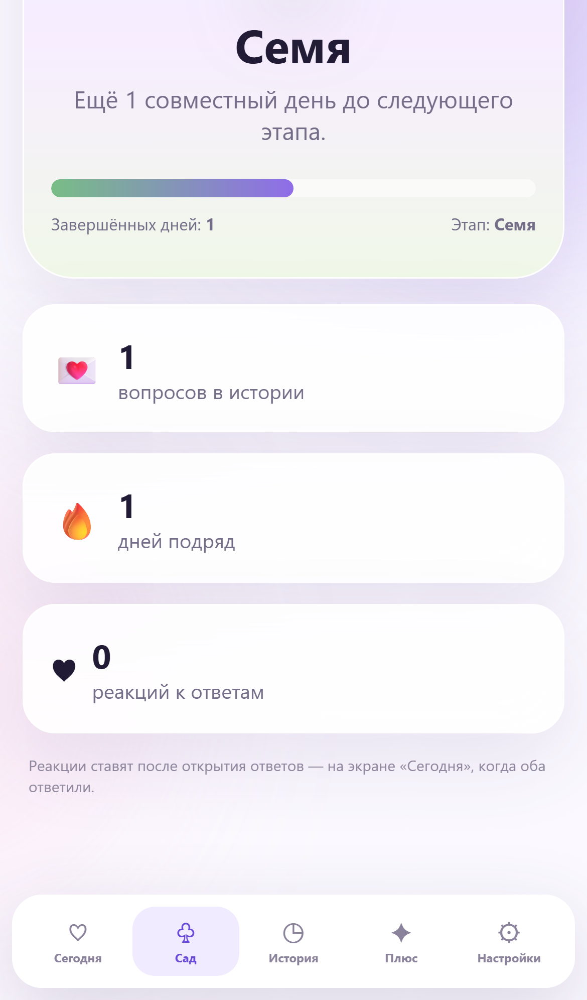
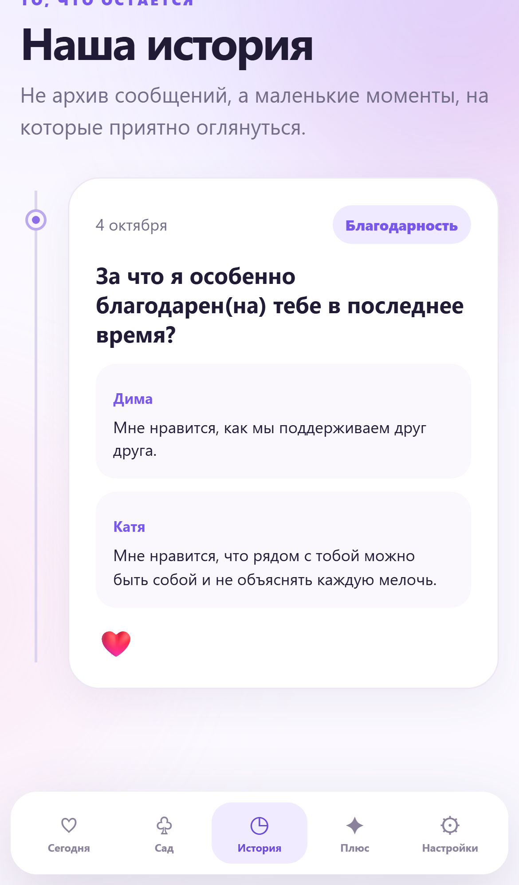
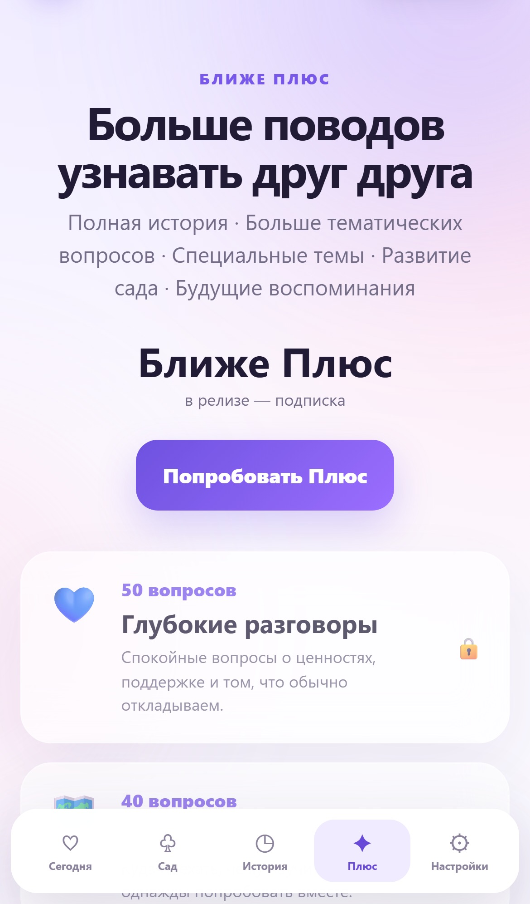
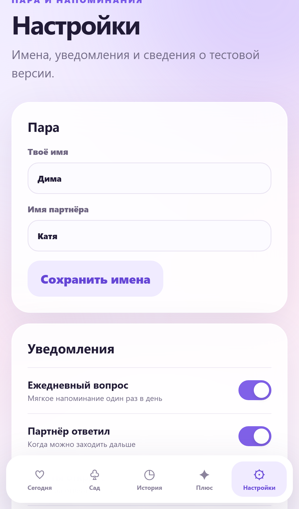

# Ближе / Couple — Hypothesis Build 0.1.0

Local-first ежедневный ритуал для пары. Этот репозиторий содержит:

- рабочую **PWA** (web);
- **Capacitor 8.5.2** native shells: **Android** + **iOS**;
- **Android APK** для user-test (10–100 тестеров);
- **iOS** Xcode-проект (сборка на macOS).

Это **не** production release. Цель — проверить продуктовую гипотезу без backend.

## Что это

Онбординг → вопрос дня → ответ → ожидание → reveal → реакция → серия → сад → история → soft paywall «Плюс».

Данные хранятся локально (IndexedDB). «Партнёр» в этой сборке отвечает через Demo Partner Engine (без сервера). Тестеру это не объясняется.

## Скриншоты (мобильное разрешение)

Чистые кадры без системных диалогов (viewport iPhone 14 ~390×844).  
Reveal → реакция ❤️ → сад.

| Онбординг | Сегодня | Ожидание | Ответы |
|:---:|:---:|:---:|:---:|
|  |  |  |  |

| Сад | История | Плюс | Настройки |
|:---:|:---:|:---:|:---:|
|  |  |  |  |

Исходники: `docs/screenshots/`. Переснять: `npm run build && npm run preview`, затем `node scripts/capture-readme-shots.mjs`.

## Структура репозитория

```
pwa/                 # Web PWA (Vite source → pwa/www)
  domain/            # CoupleRepository, DemoPartner, analytics, …
  platform/          # runtime, notifications, storage, haptics, …
  public/            # SW, manifest, offline shell
android/             # Capacitor Android native shell
ios/                 # Capacitor iOS native shell (Xcode)
scripts/             # Android build / icons / smoke / screenshots
docs/                # hypothesis, distribution, test plan
capacitor.config.ts  # webDir: pwa/www
```

```
UI (pwa/app.js + styles)
  ↓
pwa/domain/  CoupleRepository · DemoPartnerEngine · analytics · entitlements · UserSession
  ↓
pwa/platform/ runtime · notifications · storage · haptics · sharing · statusBar
  ↓
Web PWA (SW + Web Push stubs)   |   Capacitor Android/iOS (local notifications)
```

Future (post-hypothesis): `SupabaseCoupleRepository`, Realtime partner, Auth, FCM/APNs, RevenueCat.

## Версии

| Component | Version |
|-----------|---------|
| App | 0.1.0 (versionCode 1) |
| Capacitor | **8.5.2** (current stable, pinned; not prerelease) |
| Node for build | **≥ 22** (fnm recommended on Windows) |
| JDK for Android | **21** (Android Studio JBR works) |
| appId | `app.blizhe.couple` (hypothesis only — re-check before stores) |

## Web запуск

```bash
# Node 22+
npm install
npm run dev          # http://127.0.0.1:4173
npm run build        # → pwa/www/
npm test
npm run test:smoke
```

## Деплой PWA на сервер (Docker + TLS)

Клиенту на тест отдаётся **HTTPS-ссылка** (`https://<DOMAIN>/`), не apk/ipa.  
Стек: Caddy или внешний TLS proxy → nginx (static PWA). Backend нет.

### 1. Подготовка сервера

- Docker Engine 24+ и Compose v2
- Порт `APP_PORT` (по умолчанию **3007**) или **80/443** при включённом Caddy
- DNS **A/AAAA** имени сайта на IP сервера (для Let's Encrypt)

### 2. Запуск

```bash
git clone https://github.com/dmitryS1666/nearer.git
cd nearer
cp .env.example .env
```

В `.env` минимум:

```env
DOMAIN=app.example.com
ACME_EMAIL=ops@example.com
APP_PORT=3007
```

```bash
docker compose up -d --build
curl -fsS http://127.0.0.1:$APP_PORT/health   # {"status":"ok"}
```

По умолчанию Caddy в Compose закомментирован: повесьте внешний HTTPS reverse proxy на `APP_PORT`.  
Свои `.pem`, встроенный Caddy и CI/CD — в **[docs/deploy.md](docs/deploy.md)**.

### 3. Клиенту на тест

1. Ссылка: `https://<DOMAIN>/`
2. Android Chrome → «Установить приложение»
3. iOS Safari → Поделиться → «На экран „Домой“»

CI/CD на self-hosted runner'ах: [`.github/workflows/ci.yml`](.github/workflows/ci.yml), [`.github/workflows/deploy.yml`](.github/workflows/deploy.yml). Настройка runner'ов — в [docs/deploy.md](docs/deploy.md#cicd).


## Android запуск / build

```bash
# Env (Windows example)
# JAVA_HOME = Android Studio JBR (JDK 21)
# ANDROID_HOME = %LOCALAPPDATA%\Android\Sdk

npm run cap:sync:android
npm run android:build:debug
npm run android:build:release
```

Открыть в Android Studio: `npm run android`.

### APK paths

| Artifact | Path |
|----------|------|
| Debug | `artifacts/app-debug.apk` |
| Hypothesis release (signed) | `artifacts/blizhe-0.1.0-hypothesis.apk` |

Install:

```bash
adb install -r artifacts/blizhe-0.1.0-hypothesis.apk
```

## iOS запуск (macOS + Xcode)

```bash
npm run cap:sync:ios
npm run ios            # открывает Xcode
```

Структура: `ios/` рядом с `android/`. Bundle id: `app.blizhe.couple`, version `0.1.0`, portrait only.

Сборка `.ipa` / TestFlight — только на Mac. Подробности: `docs/IOS_TESTING.md`.
## Service Worker behavior

| Runtime | Behavior |
|---------|----------|
| Browser / PWA | SW registered (`public/sw.js`), offline shell + Web Push handler |
| Capacitor Android/iOS | SW **not** registered; existing registrations unregistered |

## Storage

IndexedDB (`blizhe-pwa`) via `storage.js` / `platform/storage.js`. Survives app kill/restart in WebView. Not rewritten unless a real device bug appears.

## Notifications

`NotificationService` abstraction:

- **Web:** Notifications API + SW (`WebNotificationProvider`)
- **Native:** Capacitor Local Notifications (`NativeNotificationProvider`)
- Daily reminder title: `❤️ Время для вашего вопроса`
- Time configurable in Settings (default 20:00)
- Demo partner background ping: best-effort local notification; no FCM yet

Future remote push: Supabase → Edge Function → FCM/APNs → Capacitor Push Notifications (documented, not wired).

## Test Lab

Hidden QA panel:

1. Settings → About → **7 taps** on version, or  
2. Long-press logo ~3 seconds

Controls: role, auto-answer, delay, trigger partner/reveal, streak, garden, next test day, export analytics JSON, reset.

## Reset data

Settings → **Сбросить демо-данные** (double confirm) → IndexedDB cleared → onboarding.

## Distribution

See `docs/ANDROID_DISTRIBUTION.md`:

- Option A: direct APK
- Option B: Firebase App Distribution (optional, not required)

## Signing

- Keystore generated locally under `signing/` (**gitignored**)
- Credentials in `android/keystore.properties` (**gitignored**)
- Template: `.env.signing.example` and `android/keystore.properties.example`
- Back up keystore to a password manager / secure drive. Never commit passwords.

## Feedback URL

Set `TEST_FEEDBACK_URL` in `pwa/config.js`. Empty → share/copy feedback template.

## Future Supabase

UI talks to `CoupleRepository`. Swap `LocalCoupleRepository` → `SupabaseCoupleRepository` without rewriting screens. Same for entitlements and partner engine.

## iOS

Проект уже добавлен: `ios/` + `@capacitor/ios@8.5.2`.  
Синхронизация web assets: `npm run cap:sync:ios` → открытие: `npm run ios` (macOS).

Product code uses platform adapters — no Android-only hacks in UI. See `docs/IOS_TESTING.md`.

## Known limitations

See `docs/KNOWN_LIMITATIONS.md`.

## Docs

- `docs/deploy.md` — Docker, TLS, CI/CD
- `docs/USER_TEST_RU.md` — сценарий для тестеров
- `docs/HYPOTHESIS.md` — гипотезы и критерии
- `docs/ANDROID_DISTRIBUTION.md`
- `docs/IOS_TESTING.md`
- `docs/KNOWN_LIMITATIONS.md`

